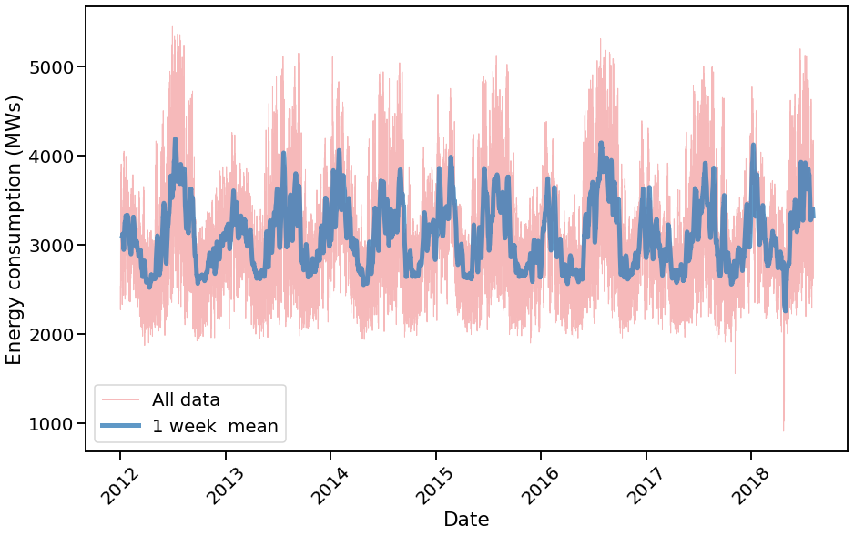
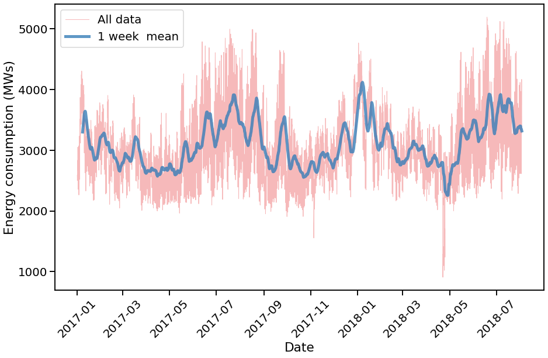
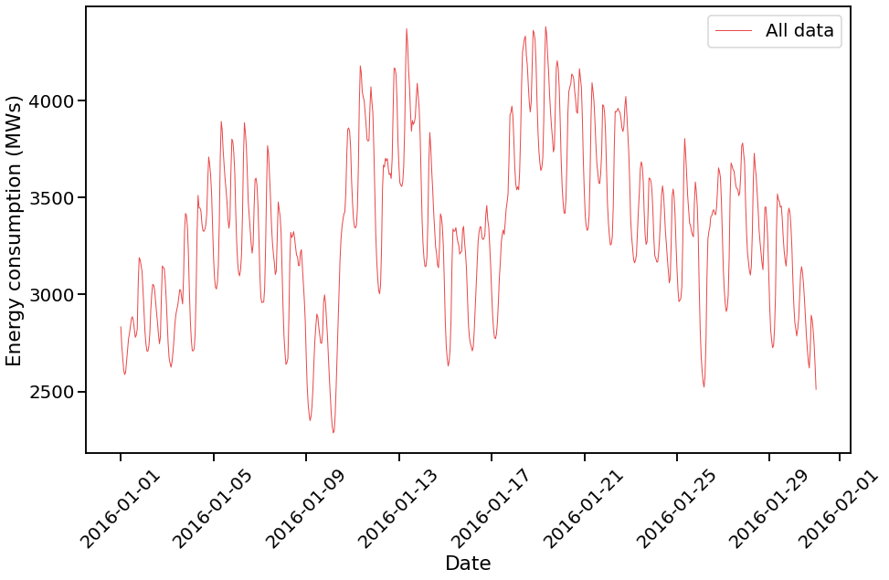
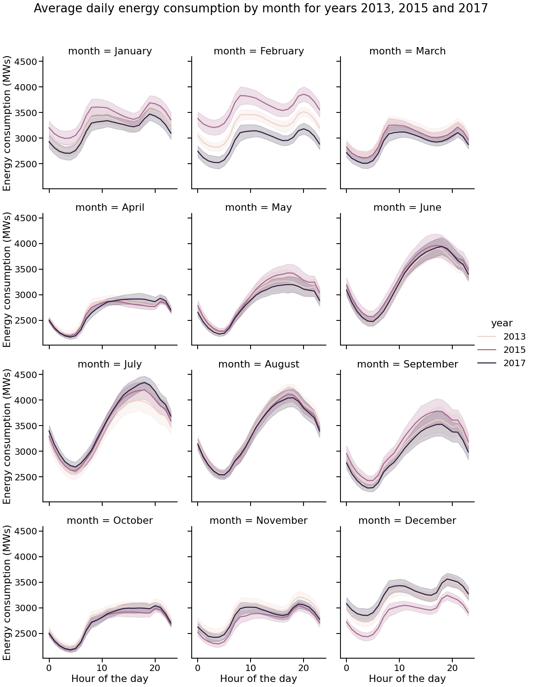
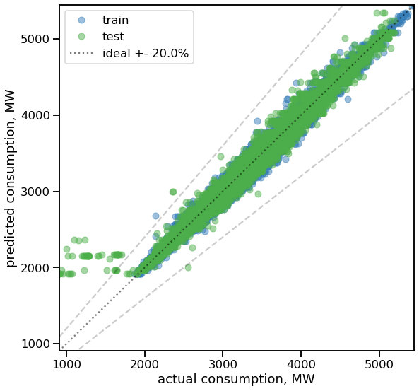
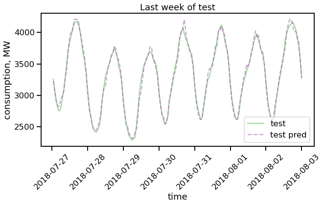
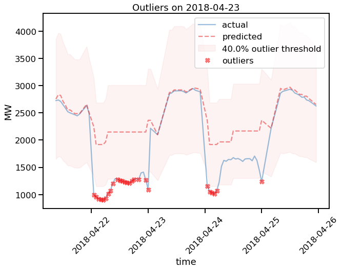
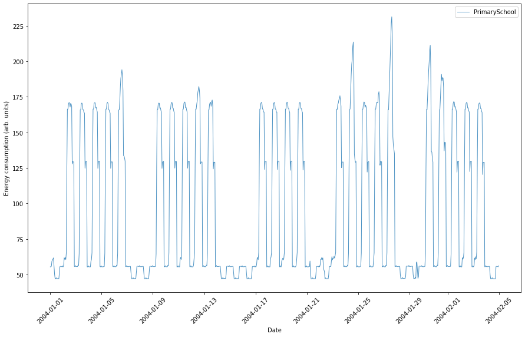

# [Swarm behavior on the Grid](https://ecosystem.siemens.com/techforsustainability/swarm-behaviour-on-the-grid/overview)

# Siemens sustainability challenge

This repository contains a quick technical demonstration that we prepared to support out idea submission for the Siemens sutainability challenge. Information about the challenge can be found [here](https://ecosystem.siemens.com/techforsustainability/swarm-behaviour-on-the-grid/overview).

----
# Section 1: data  

### **PJM Hourly Energy Consumption Data**
Dataset: [kaggle link](https://www.kaggle.com/datasets/robikscube/hourly-energy-consumption)

PJM Interconnection LLC (PJM) is a regional transmission organization (RTO) in the United States. It is part of the Eastern Interconnection grid operating an electric transmission system serving all or parts of Delaware, Illinois, Indiana, Kentucky, Maryland, Michigan, New Jersey, North Carolina, Ohio, Pennsylvania, Tennessee, Virginia, West Virginia, and the District of Columbia.

The hourly power consumption data comes from PJM's website and are in megawatts (MW).


Structure of the repository is as follows:

* `utils.py` - contains functions used in the project, to prepare data and train models
* `1-exporation.ipynb` - a notebook with data exploration and visualization.
* `2-outliers-demo.ipynb` - a notebook with a demo of our model and search for discrepancies between the model and the data.
* `3-outliers-demo-no-lags.ipynb` - a notebook with a demo of our model and search for discrepancies between the model and the data, without using lags as a predictor.
* `4-other-datasets.ipynb` - a notebook with a demonstration of other datasets we found interesting.


The content of the notebooks is shown below. Visit the notebooks for the code and change it to your liking. 

The data would be from `DEOK` power company (`data/DEOK_hourly.csv`), which is Kentucky-Ohio region in the PJM grid.


# Section 2: Quick Data Exploration

## Long-term trends in energy consumption
Let's look at the low-frequency variation in the data, related to the seasons.



and its zoomed-in version



obvious are the low-frequency variations related to the seasons, and the high-frequency variations related to the daily cycle.

## Short-term trends in energy consumption

lets look at the high-frequency variation in the data, related to the daily cycle




To elaborate, let us explore the average of many days in a few particular years (2013, 2015 and 2017) grouped by month:



We can see significant difference between daily patterns in February and December. Although day-to-day variance is large. This is an example of unexpected behaviour.

We will try finding this kind of events in the data. We will proceed to the next notebook to build a simple model for this kind of data and find differences between our expectations and the data.


# Section 3: Simple model for energy consumption and search for discrepancies

We build a simple model for energy consumption using random forest regression from `sklearn`:

```python
RandomForestRegressor(n_estimators=700, max_depth=10)
```
with which we profit from the fact that the data is highly seasonal and has a daily cycle without much feature-engineering. 

We use the following features:
- hour of the day
- day of the week
- day of the year
- energy consumption in the previous hour
- rolling mean of energy consumption in the previous 24 hours

all those parameters may be changed in the notebook, see `utils.py`.

We train the model in the first 80% of the data and test it in the last 20% of the data.
The plot below shows the predictions of the model as the function of the true values. The model is not perfect, but it is good enough to find discrepancies between the model and the data.




We monitor the goodness of the model by calculating the [mean absolute percentage error](https://en.wikipedia.org/wiki/Mean_absolute_percentage_error) (MAPE) on the test set. In the model from the plot, MAPE is `0.014` for the test set and `0.017` for the train set. This means that the model is not overfitting much. Note that we do not do thorough hyperparameter tuning, so the model can be improved in future.

The last week of test data is shown below:



from which we can see that the model is good enough to grasp the main patterns in the data.

We run a function to find discrepancies between the model and the data. The function is defined in `utils.py` and is called `find_outliers`. It takes the model, the data and the number of days to look back as arguments. It returns a list of days with discrepancies larger than the given threshold. 

An example of the output of the function is shown below:



in which one sees that the prediction of out model overshoots the data on the 2018-04-22 significantly (>40%).

The first thing to mention is that we did find interesting discrepancies between the model and the data with the help of our model. 
The second thing is that the calibration of model and thresholds is not perfect, and it is definetely can be improved in future.

We did not find any events on the region on that date. In addition, the shape of the consumption curve for that day suggest that this may be a data fluke  (e.g. energy grid producer turned off on the the sensort) rather than a real event. The fact is that we can start searching for events in the data with the help of our model.

## (Interlude) Search for discrepancies without using lags as a predictor

We can also search for discrepancies without using lag(s) as a predictor. This is demonstrated in notebook `3-outliers-demo-no-lags.ipynb`. 

The motivation for that is very simple: we want to fit the trends in time series data based only on the historic data and not taking into account recent events. This would help to detect long-standing changes in the data due to, e.g., geopolitical events.

# Section 4: Other datasets

We show an example load curves from the dataset used in [this project](https://github.com/armineminasyan/energy-consumption-clustering), which is based on the data from [US load profiles OEDI](https://data.openei.org/submissions/153).  

The (cleaned) data file `energy-consumption.csv.tar.bz2` can be found in the mentioned repository and it is not included in this project.

One major advantage of the dataset is that it contains data from many different regions in the US and segregated according to the building type. This would allows us to compare the load curves of different regions and land-usage type (e.g. residential vs. commercial).

An example of the load curve of a primary school in Houston, TX is shown below:



in which one clearly sees the weekely cycle and the daily cycle. In the yearlong plot, one can see the seasonal variation including the school vacations in summertime (see `4-other-datasets.ipynb`).

# Section 5: Conclusion

We have shown that it is possible to find interesting events in the data with the help of a simple model. The model is not perfect, but it is good enough to find discrepancies between the model and the data. Making a catalog of such events would be a good starting point for further research into the causes and effect of different type of happenings on the energy consumption for more sustainable energy usage.

We have shown that the model can be used to find discrepancies in the data without using lags as a predictor. This would help to detect long-lasting changes in the data due to, e.g., weather conditions.

We provide an example of the load curve of a particular type of building in Houston, TX. This would allow us to compare (and predict) the energy curves of different regions and districts, furtherly helping to make more efficient grid management.


